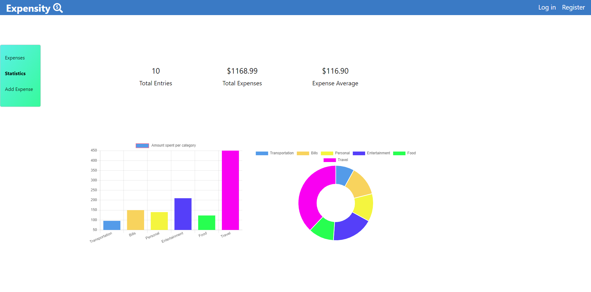

# Expensity

### Demo
https://expensity-client.tnphan0204.now.sh/

### About
Expensity is an expense tracking app that helps users keep track of their expenses. Users can log their expenses by entering in the amount spent, selecting a category, and entering a description. On the statistics page, all expenses can be seen in the graphs and users can see statistics about their spending habits.

### API Documentation for the back end
Registering a new user makes a POST to '/api/users'
Returning users login by making a POST to '/api/auth/login'
List of expenses can be found by a GET request to '/api/expenses'
A specific expense can be found and updated by a GET/PATCH request to '/api/expenses/:expenseId' 

### Technologies Used
React, JavaScript, Node.js, Express, PostgreSQL, Knex, CSS, Mocha, Chai, 

### Screenshots

